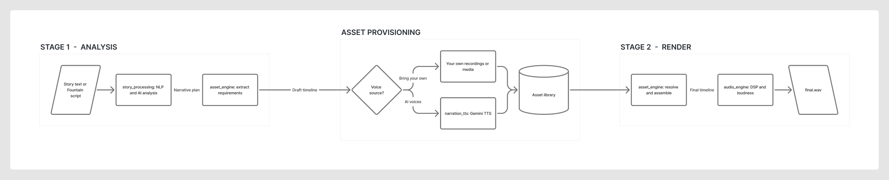
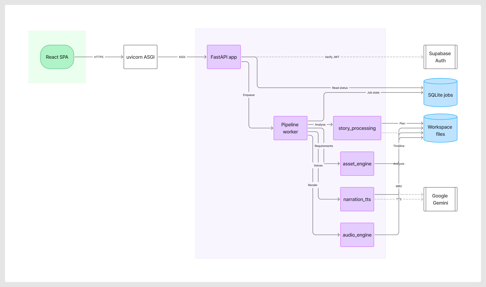

# AudStories

Turn a story into finished audio. AudStories takes prose or a Fountain script, works out
what it should sound like, and renders a mixed, loudness-normalised WAV — as an
**audiobook** (a narrator reads everything) or an **audio drama** (characters speak, and
description becomes sound rather than narration).

[](https://github.com/blzee-maker/audstories/actions/workflows/ci.yml)
[](LICENSE)
[](https://python.org)
[](docs/TESTING.md)

---

## The pipeline



Work happens in two stages with a deliberate pause between them. **Stage 1** analyses the
story and tells you what audio it needs. You then supply that audio — generated voices,
your own recordings, or music and effects from your library. **Stage 2** resolves what you
provided into a timeline and renders it.

That pause is the point: you decide what the piece sounds like, rather than accepting
whatever a model picks.

## Architecture



The API is a thin layer. It authenticates, records job state in SQLite, and hands work to
a single-threaded worker that runs each pipeline stage as a subprocess. The four engines
do the real work and are independently testable:

| Engine | Responsibility |
|---|---|
| [`story_processing`](backend/pcddj_engine/story-to-script/) | spaCy + Gemini analysis, Fountain parsing, narrative plan |
| [`asset_engine`](backend/asset_engine/) | Asset requirements, library resolution, pacing rules |
| [`narration_tts`](backend/narration_tts/) | Gemini TTS voice synthesis |
| [`audio_engine`](backend/audio_engine/) | Timeline rendering, EQ, ducking, fades, loudness |

Supabase is used **only** for authentication; all project and job state is local SQLite.
Gemini is the only other external dependency.

On Supabase's current *JWT Signing Keys* model the backend holds **no Supabase
secret at all** — user tokens are signed with an asymmetric key and verified against
the project's public JWKS endpoint. Projects still on the older shared HS256 secret
are also supported; see [SETUP.md](SETUP.md).

## Hear it

[**docs/audio/render-demo.mp3**](docs/audio/render-demo.mp3) — 15 seconds of the audio
engine's output, rendered from the one music fixture in this repository with its gain,
fade and loudness stages applied.

It is a render demo, not a finished drama: no third-party voice, ambience or SFX is
committed here, so there is nothing to mix against. Reproduce it yourself with:

```bash
python examples/render_demo.py
```

That needs FFmpeg and the project's dependencies — **no API keys and no accounts** — and
is the fastest way to confirm an install is working.

---

## Quick start

### Docker

```bash
cp backend/.env.example backend/.env
# set AS_DEV_NO_AUTH=1 and GEMINI_API_KEY in backend/.env
docker compose up --build
```

Open **<http://localhost:8000/docs>** and drive the pipeline from there: create a project,
run Stage 1, generate voices, render Stage 2. No sign-in, no Supabase project.

> The first build pulls PyTorch and a 560 MB spaCy model, so give it a while.

### Native

```bash
./setup.sh          # macOS / Linux
.\setup.ps1         # Windows
```

Needs Python 3.13+, Node 18+, and FFmpeg on PATH. Full walkthrough in [SETUP.md](SETUP.md).

You need a [Gemini API key](https://aistudio.google.com/app/apikey) for story analysis and
TTS. You do **not** need a Supabase account unless you want the web UI.

---

## Repository layout

| Path | Contents |
|---|---|
| `backend/api/` | FastAPI app — routes, auth, job worker, SQLite state store |
| `backend/asset_engine/` | Requirements extraction, asset resolution, pacing rules |
| `backend/audio_engine/` | DSP, timeline renderer, loudness |
| `backend/pcddj_engine/story-to-script/` | NLP pipeline, Fountain DSL, narrative plan |
| `backend/narration_tts/` | Gemini TTS synthesis |
| `frontend/` | React + Vite single-page app |
| [`docs/`](docs/README.md) | Engine and pipeline documentation, indexed |
| `examples/` | Sample Fountain scripts, the render demo, an example asset library |

## Status and known limits

Honest about where this is:

- **The React frontend requires a Supabase project.** Several pages read and write its
  `projects`/`units` tables directly, so the UI cannot run without one. Moving that
  storage behind the API is the obvious next step.
- **The API does not.** Set `AS_DEV_NO_AUTH=1` in `backend/.env` and the whole pipeline is
  drivable from `/docs` with no account. That flag disables authentication entirely and
  refuses to start if `CORS_ORIGINS` names any non-local origin.
- **The job queue is in-process.** State survives restarts, but work is not distributed;
  a real broker would be needed to scale past one server.
- **No screenshots yet** — they need a live Supabase project to capture.

Setup is verified on **Windows** (`setup.ps1`), **Linux** (`setup.sh`, exercised in a clean
container against a fresh clone) and **Docker**. The renderer produces byte-identical
output on all three.

All six test suites pass — **437 tests**, about a minute for the backend. Every push
runs them on Linux; a separate weekly job reinstalls from scratch and re-renders the
demo, so the setup instructions cannot rot unnoticed. See
[docs/TESTING.md](docs/TESTING.md).

## Contributing

[CONTRIBUTING.md](CONTRIBUTING.md) covers the setup, the conventions, and the few traps
that are easy to hit and hard to diagnose — the shadow directories, the dependency
install order, and why the editable installs are mandatory.

## Licence

Apache-2.0 — see [LICENSE](LICENSE).

Audio assets are licensed separately and listed individually in [CREDITS.md](CREDITS.md).
Every audio file committed here originates with the project; none is required to build or
run it.
