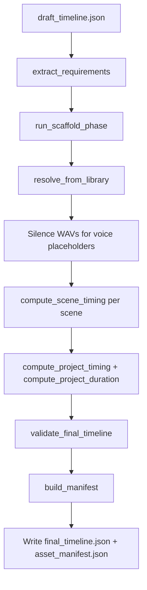

# Asset Engine — Complete Reference

This document describes the **`asset_engine`** Python package: what it is for, how it is structured, and how each part behaves. It reflects the **current implementation** in the repository. For historical context, redesign rationale, and future phases, see [`asset_engine/ASSET_ENGINE_DESIGN.md`](../backend/asset_engine/ASSET_ENGINE_DESIGN.md).

---

## 1. Role in the pipeline

The Asset Engine sits **between** upstream story/script tooling (which emits a **draft** timeline) and downstream **audio rendering** (which consumes a **final** timeline with real file paths and timing).

| Direction | Artifact | Contents |
|-----------|----------|----------|
| **In** | `draft_timeline.json` | Abstract clips: `tts_text`, `mood`, `atmosphere`, `sfx_hint`, track layout, scene structure |
| **Out** | `final_timeline.json` | Concrete `file` paths, per-clip `offset`, scene `start` / `duration`, project `duration` |
| **Out** | `asset_manifest.json` | Per-clip resolution status, confidence, notes (traceability) |
| **Out** (optional) | `generated/voice/…_silence.wav` | Placeholder WAVs for missing voice when policy applies |

The engine follows a **library-first** model: expected audio lives under a **known folder tree** derived from the draft. There is no fuzzy filename matching in the active path; resolution is **deterministic** from folder paths and optional stem matching inside each folder.

---

## 2. Installation and entry point

- **Package name:** `asset-engine` (see `asset_engine/pyproject.toml`).
- **Python:** ≥ 3.10.
- **CLI:** `asset-engine` → `asset_engine.cli:main`.
- **Dependencies:** `pydantic`, `pydub`, `soundfile` (duration probing via libsndfile).

Install from the `asset_engine` directory in development:

```bash
pip install -e ".[dev]"
```

---

## 3. Command-line interface

Implemented in [`asset_engine/src/asset_engine/cli.py`](../backend/asset_engine/src/asset_engine/cli.py).

| Command | Purpose |
|---------|---------|
| `scaffold` | Create/update library folders and instruction files from `--draft`; writes `REQUIREMENTS.md` at library root |
| `status` | Resolve against the library **without** writing outputs; prints counts and `READY TO RESOLVE: YES/NO`; exits **1** if anything is still “missing” from the resolver’s perspective |
| `resolve` | Run full pipeline: scaffold (inside `run_asset_pipeline`), resolve, timing, validation, write `final_timeline.json` + `asset_manifest.json` under `--out` |
| `resolve --dry-run` | Same reporting as `status` (no files written) |
| `run` | `scaffold` → `resolve` (unless `--dry-run`) → always `status`; prints `Assets missing…` or `Render ready.`; exits **1** if not ready |

**Note:** `resolve --dry-run` currently mirrors `status` (it does not perform a “validate outputs only” dry-run). Full resolve always runs `run_scaffold_phase` inside `run_asset_pipeline`.

**Ready vs runnable:** `status` sets `READY TO RESOLVE: YES` only when `len(resolution.missing) == 0`. The resolver appends **voice placeholders** (missing WAV but filled later with silence in `resolve`) to `missing` as well as `placeholders`. So a project can **successfully** run `resolve` with silence placeholders while `status` still reports **not** ready—reflecting “not all real assets are on disk.”

---

## 4. End-to-end flow

High-level orchestration lives in [`asset_engine/src/asset_engine/pipeline/run_asset_pipeline.py`](../backend/asset_engine/src/asset_engine/pipeline/run_asset_pipeline.py).



1. **Load draft** → `DraftTimeline` (Pydantic).
2. **Extract** → flat list of `AssetRequirement` records (one per clip that has the needed descriptor).
3. **Scaffold** → ensure under `--library`: `voice/…`, `music/…`, `ambience/…`, `sfx/…` with `SCRIPT.txt` or `DESCRIPTOR.txt` as appropriate; regenerate `REQUIREMENTS.md`.
4. **Resolve** → scan each requirement’s folder for audio; attach durations; apply **missing policies**.
5. **Placeholders** → missing **voice** entries get generated silence WAVs under `output_dir/generated/voice/`.
6. **Timing** → `compute_scene_timing` then `compute_project_timing` / `compute_project_duration`.
7. **Validate** → `assembly.validator.validate_final_timeline` on the dict payload.
8. **Manifest** → `build_manifest` for traceability.
9. **Write** JSON files to the output directory.

---

## 5. Input contract: draft timeline

Defined in [`asset_engine/src/asset_engine/contracts/draft_models.py`](../backend/asset_engine/src/asset_engine/contracts/draft_models.py).

- **`project`:** `name`, `sample_rate`, `bit_depth`.
- **`settings`:** free-form dict; the pipeline reads **`default_silence`** (seconds, default 0.5) for gaps between voice lines and for timing.
- **`tracks`:** list of `DraftTrack` (`id`, `type`, `role`, `gain`, `eq_preset`, `semantic_role` for SFX tracks, etc.).
- **`scenes`:** each has `id`, `name`, `energy`, `rules`, and **`tracks`**: a **dict** mapping **track id** → **list of `DraftClip`**.

Each `DraftClip` may carry narration text, mood, ambience, SFX hints, anchors, loops, fades, etc. Only clips that satisfy the extractor’s conditions become `AssetRequirement`s (see §7).

---

## 6. Output contracts

### 6.1 `final_timeline.json`

Built as a dict in `run_resolve_phase` (not via `assemble_final_timeline` in the current pipeline). Conceptually aligned with [`contracts/final_models.py`](../backend/asset_engine/src/asset_engine/contracts/final_models.py): project block, settings, track definitions (with empty `clips` at top level), and **`scenes`** each with:

- `id`, `name`, `duration`, `energy`, `rules`, `start` (after project timing pass)
- **`tracks`:** map of track id → list of clip dicts with at least `file`, `offset`, and optionally `loop`, `semantic_role`, `timing_source` (voice)

Skipped non-voice clips (missing files) are omitted from scene track lists because they never get a `file` in the assembly loop.

### 6.2 `asset_manifest.json`

Produced by [`assembly/manifest_builder.py`](../backend/asset_engine/src/asset_engine/assembly/manifest_builder.py) using [`contracts/manifest_models.py`](../backend/asset_engine/src/asset_engine/contracts/manifest_models.py). Contains:

- `project`, `generated_at` (UTC)
- `summary`: `total`, `resolved`, `missing`, `skipped`
- `assets[]`: per-requirement `clip_id`, `scene_id`, `track`, `descriptor`, `file`, `confidence`, `confidence_note`, `resolution_status`

Confidence is derived from resolution status and optional `metadata["confidence"]` set during resolution.

---

## 7. Requirements extraction

Module: [`asset_engine/src/asset_engine/requirements/extractor.py`](../backend/asset_engine/src/asset_engine/requirements/extractor.py).

For each scene, for each `(track_id, clips)` entry, the extractor looks up the track **type** from `draft.tracks` and emits an `AssetRequirement` when:

| Track type | Condition | Descriptor source | Notes |
|------------|-----------|-------------------|--------|
| `voice` | `clip.tts_text` present | `tts_text` | `timing_intent`: first ordered voice in scene → `scene_start` / `after_previous_voice`; `gap_ms` from `default_silence`; `estimated_duration_seconds` from word count |
| `music` | `clip.mood` present | `mood` | `energy_hint`, `loop` |
| `ambience` | `clip.atmosphere` present | `atmosphere` | `loop` |
| `sfx` | `clip.sfx_hint` present | `sfx_hint` | If `anchor_order` set, `timing_intent` becomes `with_voice_<order>` for anchoring |

**Requirement id:** `{scene_id}:{track_id}:{clip_index}`.

**Clip id:** `clip_scene{idx:03d}_{track_id}_{clip_idx:03d}`.

If a track id is missing from `draft.tracks`, clips on that id are skipped.

---

## 8. Scaffold: folder layout and files

Module: [`asset_engine/src/asset_engine/scaffold/builder.py`](../backend/asset_engine/src/asset_engine/scaffold/builder.py). Helpers: [`utils/path_utils.py`](../backend/asset_engine/src/asset_engine/utils/path_utils.py).

### 8.1 Root

- **`library_root`:** user-supplied `--library` directory; created if missing.
- **`REQUIREMENTS.md`:** overwritten each run by [`scaffold/docs_writer.py`](../backend/asset_engine/src/asset_engine/scaffold/docs_writer.py) with a human-readable summary and per-requirement folder paths.

### 8.2 Folder naming (implemented behavior)

- **Slug:** `slugify()` lowercases, replaces spaces/hyphens with underscores, strips unsafe characters, truncates length.
- **Voice:**  
  `voice/{scene_NNN}_{scene_slug}_{track_slug}/clip_{idx:03d}/`  
  Example: `voice/scene_000_opening_narrator/clip_000/`.
- **Music / ambience / SFX:**  
  `{kind}/scene_{NNN}_{scene_slug}_{descriptor_slug}/`  
  Example: `music/scene_000_opening_tension_mid/`.

So folders are **per scene and per clip**, not a single global folder per mood/SFX name. Reusing the same mood in two scenes creates **two** folders.

### 8.3 Instruction files

- **Voice:** `SCRIPT.txt` written **only if missing** (`_write_if_missing`). Contains scene, speaker track, clip id, line text, recording steps, estimated duration.
- **Non-voice:** `DESCRIPTOR.txt` with descriptor, scene, optional energy / semantic role.

Scaffold is **idempotent** in the sense that existing folders are counted as “unchanged”; new folders are created as needed. Instruction files are not overwritten if they already exist.

---

## 9. Resolution: library resolver

Module: [`asset_engine/src/asset_engine/resolvers/library_resolver.py`](../backend/asset_engine/src/asset_engine/resolvers/library_resolver.py). Public API is re-exported from [`resolvers/__init__.py`](../backend/asset_engine/src/asset_engine/resolvers/__init__.py).

### 9.1 Algorithm

For each `AssetRequirement`:

1. Compute relative folder path (voice vs non-voice as in §8).
2. Resolve absolute path: `library_root / {voice|music|ambience|sfx} / folder_name`.
3. List audio files in that folder (extensions: `.wav`, `.mp3`, `.flac`, `.aiff`, `.ogg`, `.m4a`), sorted alphabetically by name.
4. **Selection:**
   - If any file’s **stem** equals the **folder’s last path segment** (case-insensitive), use that file; confidence **1.0**.
   - Else if exactly one file, use it; confidence **1.0**.
   - Else if multiple files, use first alphabetically; confidence **0.8**, note explains ambiguity.
5. **Duration:** `probe_duration_seconds()` via **soundfile** on the chosen file.

### 9.2 Missing policies

Constants in [`utils/constants.py`](../backend/asset_engine/src/asset_engine/utils/constants.py):

| Kind | Policy | Effect on requirement | Effect on pipeline |
|------|--------|------------------------|---------------------|
| Voice | `MISSING_VOICE_POLICY` = silence placeholder | `resolution_status = PLACEHOLDER`; still listed in `result.missing` | Silence WAV generated; clip keeps timing via estimated duration |
| Music | skip | `SKIPPED` | No clip in final scene tracks for that requirement |
| Ambience | skip | `SKIPPED` | No clip |
| SFX | skip | `SKIPPED` | No clip |

`ResolveResult` exposes `resolved`, `missing`, `skipped`, `placeholders` and `is_complete` (`missing` empty).

---

## 10. Timing

### 10.1 Scene-level timing (active path)

Module: [`asset_engine/src/asset_engine/timing/compute_timing.py`](../backend/asset_engine/src/asset_engine/timing/compute_timing.py).

- **Voice clips:** sorted by `sequence` (fallback large index). Offsets:
  - `timing_intent == "scene_start"` → offset `0`
  - `"after_previous_voice"` → previous end + gap (`gap_ms` or `default_silence`)
- **Duration:** from probed file if `RESOLVED`; for `PLACEHOLDER`, uses `estimated_duration_seconds`; floor via `MIN_CLIP_DURATION_SECONDS`.
- **Scene duration:** from last voice line end (if no voice clips, `0`).
- **Non-voice:** if `SKIPPED`, omitted. Otherwise offset `0` unless **SFX** has `anchor_order`: then offset is computed from the matching voice line’s offset/duration and `anchor_position` (`before` / `under` / `after`).

Then **`compute_project_timing`** sets each scene’s `start` by cumulative sum of prior scene `duration`s; **`compute_project_duration`** sums scene durations for `project.duration`.

### 10.2 Alternate / legacy path

[`timing/scene_timing.py`](../backend/asset_engine/src/asset_engine/timing/scene_timing.py) + [`voice_order_scheduler.py`](../backend/asset_engine/src/asset_engine/timing/voice_order_scheduler.py) implement `compute_timing(draft, requirements, resolved_map)` using a `ResolvedAsset` map. The **main CLI pipeline** uses `compute_timing` from `compute_timing.py`, not this older integration, but tests or other callers may still reference the older module.

### 10.3 Duration probing

[`timing/duration_probe.py`](../backend/asset_engine/src/asset_engine/timing/duration_probe.py): `soundfile.info` for duration in seconds.

---

## 11. Validation

[`assembly/validator.py`](../backend/asset_engine/src/asset_engine/assembly/validator.py) **`validate_final_timeline(dict)`** returns `ValidationIssue` list:

- **Errors:** missing files on disk, scene `start` not matching cumulative expectation, project duration mismatch, scene with no voice-like track ids and no clips
- **Warnings:** missing `music` / `ambience` keys, clips with `timing_source == "estimated"`

Hard errors block the pipeline (`run_resolve_phase` raises `ValueError`).

[`validation/final_validator.py`](../backend/asset_engine/src/asset_engine/validation/final_validator.py) validates against **`FinalTimeline`** Pydantic model and paths on disk; this is a **stricter** alternate validator (e.g. requires known track ids per clip). The pipeline uses the assembly validator, not this module, for the dict built in `run_resolve_phase`.

---

## 12. Assembly extras

[`assembly/timeline_assembler.py`](../backend/asset_engine/src/asset_engine/assembly/timeline_assembler.py) **`assemble_final_timeline`** builds a typed `FinalTimeline` from draft + `ResolvedAsset` maps + offset maps. It is **not** wired into `run_asset_pipeline` today; the pipeline constructs the output dict directly. Kept for compatibility or future consolidation.

---

## 13. Package layout (source)

| Area | Responsibility |
|------|----------------|
| `cli.py` | Argument parsing, subcommands, user-facing exit codes |
| `pipeline/run_asset_pipeline.py` | Scaffold phase, resolve phase, full pipeline, silence WAV writer |
| `requirements/extractor.py` | Draft → `AssetRequirement` list |
| `scaffold/` | Folder creation, `REQUIREMENTS.md` |
| `resolvers/library_resolver.py` | Folder-first resolution |
| `timing/` | Scene/project timing, duration probe |
| `assembly/` | Manifest build, timeline assembly helper, timeline dict validation |
| `validation/` | Optional strict Pydantic validation |
| `contracts/` | Draft, final, manifest, requirements datatypes |
| `utils/` | `path_utils`, `constants` |

---

## 14. Testing

Tests live under [`asset_engine/tests/`](../backend/asset_engine/tests/). Run from `asset_engine` with `pytest` (see `pyproject.toml` `pythonpath`). They cover CLI, pipeline integration, scaffold, resolver, timing, contracts, and path utilities.

---

## 15. Behavioral summary (quick reference)

- **Scaffold** is safe to re-run; it creates missing folders and skips existing instruction files.
- **Missing voice** → placeholder silence file under output `generated/voice/`, timing uses estimated duration from words/sec (`AVG_WORDS_PER_SECOND` in constants).
- **Missing music/ambience/SFX** → skipped; warnings in manifest and validator may flag empty layers.
- **`status` / `run`** treat any resolver `missing` entry as not ready (`status` exits 1; `run` prints the missing message and exits 1).

---

## 16. Related documents

| Document | Content |
|----------|---------|
| [`asset_engine/README.md`](../backend/asset_engine/README.md) | Short overview and CLI cheat sheet |
| [`asset_engine/ASSET_ENGINE_DESIGN.md`](../backend/asset_engine/ASSET_ENGINE_DESIGN.md) | Design history, problems, roadmap (TTS, catalog ideas, folder naming evolution) |
| [`doc/WORKFLOW_GUIDE.md`](WORKFLOW_GUIDE.md) | Broader project workflow (if present in repo) |

This reference should be enough to onboard a developer or operator on **what each module does** and **how data moves through the system** without reading every file line by line.

---

## V1 resolver extensions (implemented)

The current v1 branch adds optional advanced matching while keeping folder-first compatibility:

- `voice_status.json` written alongside `final_timeline.json` and `asset_manifest.json`.
- `--require-voice` strict mode (Stage 2 fails if any voice requirement is unresolved).
- `music_catalog.json` tag-based music resolver (`underscore` / `stinger` / `theme`) with score + reason metadata.
- Optional `--audio-library` for shared assets separate from project scaffold folders.
- Optional `--use-clap` lookup for SFX/ambience via `audio_library/index/{sfx|ambience}_index.json`.
- Optional `--use-freesound` fallback for unresolved SFX/ambience (best effort, non-fatal).
- Manifest assets now include optional `source`, `score`, and `resolution_details` fields.

New CLI helpers:

- `asset-engine library index --kind sfx --audio-library <path>`
- `asset-engine library index --kind ambience --audio-library <path>`
- `asset-engine library validate-music --music-catalog <path>`
