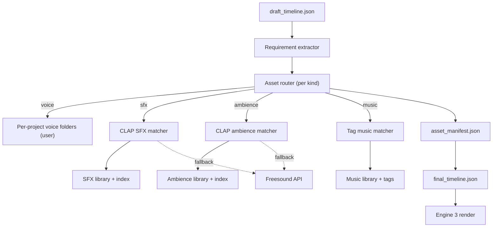

# Asset Engine v1 — Architecture Design

## Goal

Define how Engine 2 (the asset stage) supplies Engine 3 (the audio render) with the right audio files, given:

- a deterministic Stage 1 `draft_timeline.json`
- a per-project Gita continuity file
- limited compute and limited internet usage

The v1 is intentionally simple, predictable, and reviewable. We optimize for correctness and reproducibility before clever AI search.

## Principles

1. Voice is always user-supplied for v1.
2. SFX and ambience use a small, high-quality, CLAP-embedded local library, with a Freesound fallback only when local search is weak.
3. Music does not use CLAP. We use a structured tag catalog organized by genre and dramatic function.
4. Every resolution is auditable — we always know why a file was picked.
5. The pipeline must run end-to-end without any LLM call.

## What stays the same

We keep the existing strong contracts and folder-first scaffolding from `[asset_engine/src/asset_engine/resolvers/library_resolver.py](../backend/asset_engine/src/asset_engine/resolvers/library_resolver.py)` and `[asset_engine/src/asset_engine/resolvers/catalog.py](../backend/asset_engine/src/asset_engine/resolvers/catalog.py)`. They already give us:

- per-requirement folder paths
- explicit "missing" / "placeholder" / "skipped" outcomes
- alphabetical first-file fallback inside scaffolded folders

The new design wraps this rather than replacing it.

## High-level data flow



## Layer 1 — Voice (user-supplied)

Source of truth: scaffolded per-project folders under
`workspace/projects/<project>/assets/voice/...`.

Rules:

- Each scaffold folder contains `SCRIPT.txt` with the line to record.
- The user places `voice.wav` (or any audio file) inside.
- Engine 2 already enforces this via `library_resolver.resolve_from_library`.
- If voice is missing, the existing placeholder behavior is preserved so Engine 3 can still render a draft mix with silence/duration estimates.

What we add:

- A `voice_status.json` summary file listing missing voice clips so users know what to record next.
- Optional `--require-voice` flag in Engine 2 to fail Stage 2 if any voice is missing, useful in production runs.

## Layer 2 — SFX and ambience (CLAP local + Freesound fallback)

We keep the SFX and ambience folders Stage 1 already scaffolds. On top of that, we add a curated **central library** that lives outside the project, shared across episodes and projects.

Recommended local library shape:

```
audio_library/
  sfx/
    bell_temple_close.wav
    bell_temple_distant.wav
    door_creak_old.wav
    footsteps_gravel.wav
    ...
  ambience/
    forest_night_distant.wav
    village_dusk_wind.wav
    interior_room_tone_dry.wav
    ...
  index/
    sfx_clap.faiss
    sfx_meta.json
    ambience_clap.faiss
    ambience_meta.json
```

Indexing pipeline (one-time / nightly):

1. Walk `audio_library/sfx/` and `audio_library/ambience/`.
2. For each file:
   - extract metadata (duration, sample rate, channels)
   - compute a CLAP audio embedding (Microsoft CLAP or LAION-CLAP)
   - store the vector in a FAISS or numpy-mmap index
   - store searchable text metadata in `*_meta.json` (filename tokens, tags, transcription if present)
3. Persist index files; do not block runtime if missing — the resolver falls back to current token-stem matcher.

Resolution algorithm per requirement:

1. Build a query string from the requirement’s `descriptor` plus action context, for example:
   - `temple bell distant single strike` instead of just `bell`.
2. Run a **text-to-audio** CLAP query against the relevant index and take top-k.
3. Re-rank by:
   - duration band match (instant / short / sustained)
   - role tag match (impact / movement / ambience / interaction / texture)
   - simple lexical overlap as tie-breaker
4. If best score >= threshold, resolve.
5. If best score < threshold, attempt **Freesound fallback**:
   - text query the Freesound API
   - filter by license (CC0 or CC-BY only by default)
   - filter by duration band
   - download top result into a per-project cache folder
   - copy or symlink it into the scaffolded requirement folder
6. If Freesound also fails or is disabled, we keep the existing `missing` behavior so the manifest stays honest.

Why CLAP for SFX/ambience but not music:

- SFX are mostly single-source events with strong audible identity ("bell", "door creak", "wind howl"). CLAP handles those well.
- Ambience is texture-driven and CLAP captures distance and density reasonably.
- Music has cultural and structural dimensions (genre, instruments, tempo, emotional arc) that CLAP averages out and gets wrong.

Configuration knobs:

- `clap_model: "laion-clap" | "msr-clap"`
- `score_threshold: float`
- `freesound_enabled: bool`
- `freesound_license: ["cc0", "by"]`
- `freesound_max_downloads_per_run: int`
- `cache_dir: Path`

## Layer 3 — Music (tag catalog, not CLAP)

We treat music as three roles:

1. **Underscore** — long, low-presence, loopable bed under dialogue.
2. **Stinger** — short punctuation, 3 to 8 seconds.
3. **Theme** — character or location leitmotif, recurring across scenes/episodes.

Library shape:

```
audio_library/
  music/
    underscore/
      tense_low/<...>.wav
      somber_strings/<...>.wav
      neutral_warm/<...>.wav
    stinger/
      reveal_short/<...>.wav
      impact_dark/<...>.wav
    theme/
      arnav_curious/<...>.wav
      forest_motif_bell/<...>.wav
  music_catalog.json
```

`music_catalog.json` (curated, hand-tagged):

```json
{
  "version": "1",
  "tracks": [
    {
      "path": "music/underscore/tense_low/forest_drone_a.wav",
      "role": "underscore",
      "genre": ["ambient", "cinematic"],
      "emotion": ["tension", "anxiety"],
      "energy": 0.4,
      "tempo_bpm": null,
      "loopable": true,
      "duration_s": 95.2
    },
    {
      "path": "music/stinger/impact_dark/hit_a.wav",
      "role": "stinger",
      "genre": ["cinematic"],
      "emotion": ["dread"],
      "energy": 0.8,
      "duration_s": 4.1,
      "loopable": false
    },
    {
      "path": "music/theme/forest_motif_bell.wav",
      "role": "theme",
      "tags": ["bell", "forest", "ritual"],
      "emotion": ["mystery"],
      "loopable": false,
      "duration_s": 18.7
    }
  ]
}
```

Resolution algorithm per music requirement:

1. From Stage 1 `interpretation` and Gita, derive:
   - desired role (`underscore` for scenes with dialogue, `stinger` for scene transitions, `theme` if a Gita theme is bound to that character/location).
   - target emotion list and target energy from the scene `interpretation`.
2. Filter `music_catalog.json` by role.
3. Score candidates by:
   - emotion overlap (set intersection on `emotion` array)
   - energy distance (closeness to target on a 0-1 scale)
   - duration band match (long for underscore, short for stinger)
   - Gita preference (if a theme is bound to a character/location, prefer it)
4. Pick top 1; track confidence in `asset_manifest.json`.
5. If no candidate above threshold, mark as `missing` and let the user place a music WAV in the scaffolded music folder.

## Layer 4 — Catalog and metadata

A single registry file per library type to keep the runtime fast and reviewable:

- `audio_library/sfx_index.json` (or FAISS shard + `sfx_meta.json`)
- `audio_library/ambience_index.json`
- `audio_library/music_catalog.json`

A small CLI subcommand handles indexing:

- `python -m asset_engine.cli library index --kind sfx`
- `python -m asset_engine.cli library index --kind ambience`
- `python -m asset_engine.cli library validate-music`

Indexing is offline. Stage 2 only reads the indexes.

## Integration points with the existing pipeline

We change behavior in three places without breaking contracts:

1. `[asset_engine/src/asset_engine/resolvers/library_resolver.py](../backend/asset_engine/src/asset_engine/resolvers/library_resolver.py)` becomes a router:
   - voice: unchanged folder-first behavior
   - sfx: try local CLAP matcher → fall back to current alphabetical match → optionally fall back to Freesound
   - ambience: same
   - music: tag-catalog matcher with structured score
2. `[asset_engine/src/asset_engine/resolvers/catalog.py](../backend/asset_engine/src/asset_engine/resolvers/catalog.py)` is wrapped, not replaced. New `clap_index.py` and `music_catalog.py` modules sit alongside it.
3. Engine 2 CLI `[asset_engine/src/asset_engine/cli.py](../backend/asset_engine/src/asset_engine/cli.py)` gets new flags:
   - `--audio-library <path>`
   - `--music-catalog <path>`
   - `--use-clap`
   - `--use-freesound`
   - `--require-voice`

`drama_cli.py` `stage2`/`resume` commands forward those flags.

## Failure modes we explicitly accept

- CLAP model not installed → we log a warning and fall back to the existing token-stem resolver.
- Freesound unavailable → we mark missing in manifest, do not crash.
- Music catalog missing → we fall back to current music resolver behavior so old projects still work.
- Voice missing → preserved placeholder behavior so Stage 2 can still render a rough mix.

## What v1 explicitly does not do

- No real-time vector search across thousands of files. We assume 50–200 SFX and ambience files total.
- No music generation.
- No automatic stem separation.
- No per-scene mixing decisions — Engine 3 still owns the mix.
- No multi-track music alignment beyond loop or stinger placement.

## Suggested directory layout for users

```
audio_library/                # outside any single project
  sfx/...
  ambience/...
  music/...
  index/                      # generated, do not commit large vectors
  music_catalog.json

workspace/projects/<project>/
  assets/                     # scaffolded per-requirement folders, mostly user-placed voice
  output/                     # narrative/draft/final/manifest
  gita.json
```

## Phased rollout

1. Phase A — Music catalog + role-aware resolver only. No CLAP, no Freesound. Backward-compatible flag gated.
2. Phase B — CLAP indexer + matcher for SFX/ambience. Indexing CLI, threshold config, manifest logs scoring.
3. Phase C — Freesound fallback with license filter and per-run cap.
4. Phase D — Gita-aware music themes and per-character/location preference application.

This order keeps every step small, testable, and reviewable on its own.

## Why this matches your v1 thoughts

- Voice stays a user responsibility. Your call.
- SFX/ambience get semantic search where it actually works (CLAP) and a single online fallback (Freesound) that respects licenses.
- Music stays explicit, structured, and culturally honest, with clear roles for underscore, stinger, and theme.
- Existing Engine 2 behavior remains the default if any new layer is missing or disabled, so we never regress the current Trail of Bells run.
