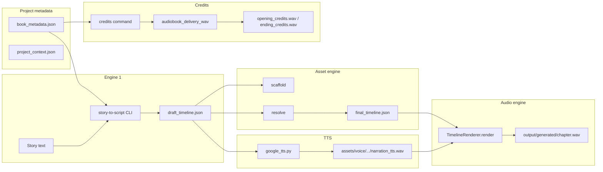

# Audiobook pipeline — technical overview

This document describes the **narration-only audiobook** path in the AudStories / AS repo: how text becomes chapter WAVs, credits, and analyzed masters. Use it for **engineering onboarding** and **UI/backend integration** (mapping screens, jobs, and file delivery to the same flows the CLI uses today).

---

## 1. Scope

| In scope (current CLI) | Out of scope (unless noted) |
|------------------------|-----------------------------|
| `project_type: audiobook`, `narration_only: true` | Audio drama (multi-character, SFX, music beds) |
| Multi-chapter projects (`chapters[]`, `active_chapter_slug`) | Single shared `final.wav` for the whole book as the only artifact |
| Google Gemini–based TTS (`narration_tts`) | ElevenLabs or other providers in the same code path (metadata allows a label only) |
| Two-stage pipeline: story → draft → assets → mix | FastAPI/Celery workers (planned; see §10) |
| Delivery preset **audiobook_retail** (48 kHz, LUFS, peak, padding on chapter masters) | Store-specific MP3/AAC encoding (manual or future encoder step) |

---

## 2. High-level architecture



**Orchestrator:** `run_pipeline.py` (Stage 1: Engine 1 + scaffold; Stage 2: resolve + audio engine render). **Human-facing helper:** `book_cli.py` (init, chapters, stage1, synthesize, resume, run, credits).

---

## 3. On-disk layout (per project)

Root: `workspace/projects/<project_id>/` (configurable via `--projects-root`).

| Path | Purpose |
|------|---------|
| `book_metadata.json` | Book title, writer, chapters, active chapter, `delivery_profile`, optional `credits` overrides |
| `project_context.json` | Written by `run_pipeline` — resolved `assets_root`, `output_root`, `project_type`, etc. |
| `chapters/<slug>.txt` | Source text per chapter |
| `output/draft_timeline.json` | Draft after Engine 1; merged with delivery preset before scaffold/resolve |
| `output/final_timeline.json` | Resolved timeline with real file paths and timing |
| `output/asset_manifest.json` | Resolved vs unresolved assets |
| `assets/voice/.../clip_.../narration_tts.wav` | Per-clip TTS output (Gemini) |
| `output/generated/<chapter_stem>.wav` | **Chapter master** for the active chapter (stem from `book_metadata` chapters + `active_chapter_slug`) |
| `output/generated/opening_credits.wav` | Opening credits (after TTS + retail mastering) |
| `output/generated/ending_credits.wav` | Ending credits (same) |

Chapter WAV naming uses `_chapter_wav_stem_from_book_metadata()` in `run_pipeline.py` (prefers `chapters` + `active_chapter_slug`, falls back to legacy `chapter_title`).

---

## 4. `book_metadata.json` (audiobook essentials)

Minimal shape (multi-chapter):

```json
{
  "book_title": "My Book",
  "project_id": "My_Book",
  "writer_name": "Author Name",
  "project_type": "audiobook",
  "narration_only": true,
  "delivery_profile": "audiobook_retail",
  "chapters": [
    { "title": "Chapter 1", "slug": "Chapter_1", "file": "chapters/Chapter_1.txt" }
  ],
  "active_chapter_slug": "Chapter_1",
  "chapter_title": "…",
  "chapter_slug": "…",
  "chapter_file": "chapters/…",
  "credits": {
    "voice_name": "AI Narrator",
    "tts_provider": "google",
    "provider_line": null,
    "opening_text": null,
    "closing_text": null
  }
}
```

- **`delivery_profile`:** selects a JSON file under `delivery_presets/<name>.json` merged into `draft_timeline.json` at Stage 1 and before Stage 2 (see §5).
- **`credits`:** optional; `opening_text` / `closing_text` override default templates when set to non-empty strings.
- **Legacy projects** without `chapters[]` are normalized in memory by `book_cli` / pipeline logic when possible.

---

## 5. Delivery presets

Location: `delivery_presets/audiobook_retail.json` (and `audio_drama_default.json` for non–narration-only).

**audiobook_retail** (illustrative — see repo for truth) merges into timeline JSON:

- `project.sample_rate` — e.g. **48000** Hz export alignment.
- `settings.peak_target_dbfs` — e.g. **-3.0** dBFS (master peak ceiling).
- `settings.target_lufs` — e.g. **-20** LUFS (used for credits post-process; chapter mix uses timeline loudness + engine).
- `settings.output_padding` — head/tail silence on **chapter** renders inside the audio engine (not applied to credits WAVs in `audiobook_delivery_wav.py` to avoid stacking silence on re-runs).

`run_pipeline._apply_delivery_preset_to_draft()` deep-merges preset into `draft_timeline.json` after Engine 1 and again at Stage 2 entry so `resume` picks up metadata without re-running Engine 1.

---

## 6. CLI commands (`book_cli.py`)

| Command | Role |
|---------|------|
| `init` | Wizard: creates project folder, first chapter, `book_metadata.json`, optional `credits` for audiobook |
| `add-chapter` | Append chapter file + metadata; sets `active_chapter_slug` |
| `list-chapters` | Lists slugs and active chapter |
| `set-chapter --chapter SLUG` | Sets `active_chapter_slug` (and legacy chapter fields) |
| `stage1 [--chapter SLUG]` | Runs `run_pipeline.py` with story path for that chapter; on success updates `active_chapter_slug` |
| `synthesize [--force]` | Fills `narration_tts.wav` clips from `draft_timeline.json` via `narration_tts.google_tts` |
| `resume` | Stage 2: resolve + render → `output/generated/<stem>.wav` |
| `run [--chapter SLUG] [--force]` | `stage1` → `synthesize` (if narration-only) → `resume` |
| `credits [--force]` | TTS for opening/ending scripts + **audiobook_retail** mastering on `opening_credits.wav` / `ending_credits.wav` + audio analysis block |

Global: `--projects-root` (defaults to `<repo>/workspace/projects`).

---

## 7. Pipeline stages (narration-only audiobook)

### Stage 1 — Story → draft + scaffold

1. **Engine 1** (`pcddj_engine/story-to-script/cli.py process`): reads chapter text, fast path for `audiobook` + `narration_only` (minimal plan + `compile_timeline`).
2. **`run_pipeline`** merges **delivery preset** into `output/draft_timeline.json`.
3. **Asset engine scaffold** creates expected folders under `assets/` (e.g. voice clip paths).

### Stage 2 — TTS clips (CLI: `synthesize`)

- `narration_tts.google_tts.fill_voice_requirements_from_draft()` walks voice requirements, calls **`synthesize_text_to_linear16_wav`** (Gemini streaming; long text split at `_MAX_SYNTH_CHARS`).
- Output: `assets/voice/.../narration_tts.wav` per clip.
- **`--force`** overwrites existing clips (needed when clip paths are reused across chapters).

### Stage 2 — Resolve + render (CLI: `resume`)

- Asset engine **resolve** produces `final_timeline.json` + `asset_manifest.json`.
- **Audio engine** (`audio_engine/main.py` → `TimelineRenderer.render`) mixes to **`output/generated/<stem>.wav`**.
- Legacy render path **resamples** the master to `project.sample_rate` from the timeline (aligns TTS-native rate, e.g. 24 kHz, to 48 kHz preset).
- **Verification:** manifest unresolved assets, WAV header, duration check (with optional padding-aware logic for audiobooks).
- **`_print_stage2_report`:** prints **`print_wav_output_analysis`** for the chapter WAV.

### Credits (CLI: `credits`)

1. Build script from `narration_tts/credits_text.py` (templates or `credits.opening_text` / `credits.closing_text`).
2. **TTS** to `output/generated/opening_credits.wav` and `ending_credits.wav`.
3. **`narration_tts/audiobook_delivery_wav.apply_audiobook_retail_to_wav`:** resample to 48 kHz, LUFS toward preset, peak to **-3 dBFS** (same retail intent as chapters; no head/tail padding on credits in this module).
4. **`print_wav_output_analysis`** for each file (format, sample rate, **PCM bitrate**, channels, duration, peak, RMS, LUFS, informal publish notes).

---

## 8. Environment and dependencies

- **Gemini / Google GenAI:** `GEMINI_API_KEY` (and model/voice env vars as documented in `narration_tts/google_tts.py`).
- **Analysis:** `soundfile`, `numpy`; **LUFS** optional via `pyloudnorm` (chapter and credits analysis).
- **Mastering:** credits path uses **`pydub`** + **`audio_engine`** DSP (`apply_lufs_target`, `normalize_peak`); align `PYTHONPATH` / working directory with how `book_cli` adds `asset_engine` and repo root.

---

## 9. UI integration notes (API design)

When wrapping this pipeline in a **FastAPI + worker** or similar:

1. **Project identity:** map UI `project_id` to filesystem-safe id (same rules as `_sanitize_project_id` in `book_cli` / `run_pipeline`).
2. **Chapters:** expose CRUD for `chapters[]` and `active_chapter_slug` consistent with `book_metadata.json`.
3. **Jobs:** one job per **`stage1`**, **`synthesize`**, **`resume`**, **`credits`** (or composite `run`), with stderr/stdout captured for error display.
4. **Artifacts to surface:**
   - Paths under `output/generated/*.wav` (chapter + credits).
   - Optional: parse or duplicate **`print_wav_output_analysis`** into JSON for the UI (format, Hz, kbps PCM, duration, LUFS, peak).
5. **Polling:** after `resume` / `credits`, poll until file exists and size &gt; 0, then show analysis.
6. **Credits copy:** edit `book_metadata.credits` in UI; re-run `credits --force` to regenerate speech + mastering.

---

## 10. What’s implemented vs remaining

### Implemented (CLI / local)

- [x] Multi-chapter metadata and chapter selection for stage1/resume.
- [x] Delivery preset merge (**audiobook_retail**) for chapter pipeline.
- [x] Gemini TTS for narration clips + chunking for long text.
- [x] Chapter master WAV with resampling, loudness/peak/padding per timeline + preset.
- [x] Post-render **audio analysis** (chapter render + credits).
- [x] **Opening / ending credits** as separate WAVs + retail mastering pass.
- [x] `book_cli` workflow for init → chapters → stage1 → synthesize → resume → credits.

### Recommended next steps (product / engineering)

| Area | Suggestion |
|------|------------|
| **API layer** | FastAPI (or similar) endpoints that enqueue subprocesses to `run_pipeline.py` / `book_cli.py` with `project_id`, mirror `doc/AUDIOBOOK_END_TO_END_TODO.md` where still relevant. |
| **Job queue** | Redis + Celery/RQ for long-running TTS and render; persist status in DB for UI polling. |
| **Encoded masters** | Optional ffmpeg step: PCM WAV → MP3/AAC at distributor-specified bitrate (e.g. 192 kbps) without replacing archival WAV. |
| **Single manifest for delivery** | JSON listing play order: `opening_credits.wav` → chapter WAVs by sort order → `ending_credits.wav` for players and store packaging. |
| **Human QC** | Flag in DB or UI for “approved” before download; no code in repo today. |
| **Self-narrated path** | User-uploaded WAVs into scaffold paths; pipeline already resolves files — document upload mapping in UI (see existing TODO doc). |
| **Streaming render parity** | `TimelineRenderer.render_streaming` is not the default `main.py` path; credits mastering is separate. If you switch chapter render to streaming-only, re-validate preset + padding parity. |
| **ElevenLabs / multi-provider** | Metadata has `tts_provider` / `provider_line` for copy only; wiring a second TTS backend would be new code in `narration_tts`. |
| **Accessibility / i18n** | Credit templates are English-only; parameterize or add locale keys for UI-driven copy. |

### Doc cross-references

- `doc/AUDIOBOOK_END_TO_END_TODO.md` — browser + FastAPI + Supabase checklist (partially superseded by current CLI features; merge carefully).
- `doc/WORKFLOW_GUIDE.md`, `doc/PIPELINE_READINESS.md` — broader repo context.
- `audio_engine/docs/` — timeline and render behavior.
- `delivery_presets/*.json` — source of truth for retail numbers.

---

## 11. Versioning

This document reflects the repository layout and behavior as of its last update. When changing presets, CLI commands, or output paths, update this file and any UI contract that mirrors it.
