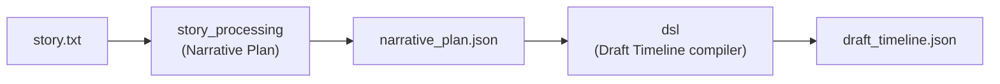
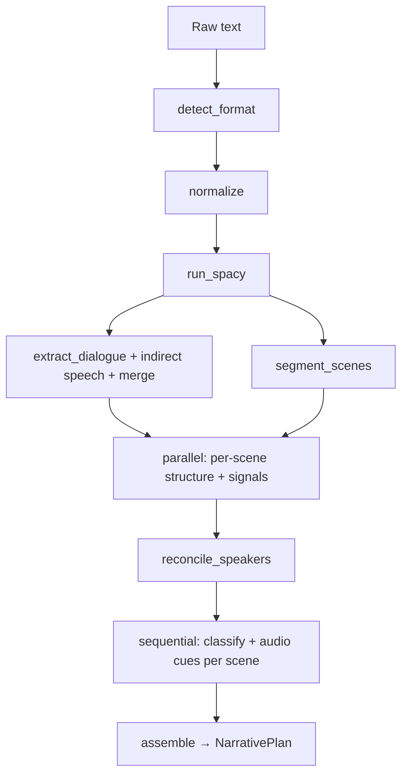

# Story-to-Script Engine — Full Reference

This document describes **Engine 1** in the PCDDJ audio storytelling pipeline: the **Story-to-Script** subsystem located under `pcddj_engine/story-to-script/`. It explains architecture, data contracts, the **DSL** layer, runtime modes, and how outputs connect to downstream engines.

For a shorter operational walkthrough, see [WORKFLOW_GUIDE.md](./WORKFLOW_GUIDE.md) and the package-local [USAGE_GUIDE](../backend/pcddj_engine/story-to-script/docs/USAGE_GUIDE.md).

---

## 1. What this engine does

The Story-to-Script engine turns **plain prose** into two machine-readable artifacts:

| Output | Role |
|--------|------|
| **`narrative_plan.json`** | A validated **Narrative Plan**: per-scene structure, numeric signals, and interpreted “meaning” (emotion, energy, style, silence intent). |
| **`draft_timeline.json`** | A **Draft Timeline**: audio-oriented layout—tracks, per-scene clips with **descriptors** (`mood`, `atmosphere`, `tts_text`, `sfx_hint`, …), plus global mixing settings. |

It does **not** load audio files, assign file paths, or render waveforms. Those are responsibilities of the **Asset Engine** and **Audio Engine** downstream.

### 1.1 Project type (`audiobook` vs `audio_drama`)

The same prose pipeline and JSON shapes are parameterized by **`project_type`** (default **`audio_drama`**). It is accepted end-to-end: `process_story` / `process_story_json`, `extract_audio_cues`, `compile_timeline` / `compile_timeline_json`, and the CLI flag **`--project-type`**.

| Mode | Voice layout | SFX | Typical music layout (compiler) |
|------|----------------|-----|----------------------------------|
| **`audio_drama`** | One **character** voice track per speaker (`voice_profile` on each); **only quoted/direct dialogue** becomes TTS clips (narration sentences without dialogue are not voiced on character tracks). | **Conditional** `sfx` track when cues or legacy thresholds apply. | Multi-scene: **intro** on first scene, **outro** on last; single-scene: **background** bed. |
| **`audiobook`** | Single **`narrator`** track; **every sentence** is a clip in order (attribution preserved in text). | **No** SFX track. | Single-scene: **intro**-style clip; multi-scene: same intro/outro pattern as drama. |

`draft_timeline.json` records the choice under **`settings.project_type`**. Audio cue LLM prompts are selected in **`story_processing/ai/audio_cue_prompts.py`** based on this flag.

Conceptually:

---

## 2. Is there a DSL?

**Yes.** In this codebase, “DSL” means a **domain-specific layer for audio storytelling**, not a separate little programming language that authors type by hand.

Evidence is explicit in `dsl/__init__.py`: the package is documented as the **Domain Specific Language for Audio Storytelling**—it defines the **vocabulary and rules for expressing sonic intent**. Authors still write ordinary story text; the engine emits structured JSON that conforms to that vocabulary.

Concretely, the DSL consists of:

1. **Schema (types)** — Pydantic models in `dsl/schema.py` for `DraftTimeline`, `DraftTrack`, `DraftClip`, `DraftSettings`, etc. These fix allowed fields, literals (track types, EQ presets, SFX semantic roles), and which descriptors belong to which clip kinds.
2. **Semantics (tables)** — Deterministic mappings in `dsl/constants.py` (emotion → music mood base, energy → suffix, emotion+style → ambience tag, gain formulas, SFX thresholds, ducking defaults).
3. **Compilation** — `dsl/compiler.py` orchestrates **Narrative Plan → Draft Timeline**.
4. **Builders** — `dsl/builders/*.py` implement the translation rules (tracks, voice/music/ambience/SFX clips, global settings, per-scene rules).
5. **Validation** — `dsl/validator.py` enforces consistency and clamps values (“never crash, always clamp”), aligned with the story-processing validator philosophy.

So: **there is no custom `.dsl` source file or lexer/parser for human-written syntax.** The DSL is the **contract + compiler** between the narrative layer and the asset layer.

---

## 3. High-level architecture

### 3.1 Phase A — Story processing (`story_processing/`)

End-to-end entry point: `story_processing.pipeline.process_story()`.

**Pipeline (simplified):**

- **Deterministic work** (normalization, spaCy, dialogue, scene spans, structure metrics, GoEmotions-based emotion scores, etc.) is heavily **parallelized per scene** via `ThreadPoolExecutor`.
- **Classification** runs **sequentially** scene-by-scene so LLM throughput is predictable and **cross-scene context** (`StoryContextBuilder`) stays ordered.
- **`QuotaExhaustedError`** (from `story_processing.ai.llm_client`): if the provider signals quota exhaustion, the pipeline **disables the LLM for the rest of the story**—remaining scenes use heuristics for classification and the **KB path** for audio cues (with empty `narration_segments` where applicable).
- **Scene headings** (`strip_scene_heading` / `extract_scene_name` in `pipeline.py`): a leading line matching patterns like `Scene 1: …` or `Chapter II — …` is removed from the first sentence’s TTS text and may set **`structure.scene_title`** for DSL scene naming (see §5 for validation caveats).
- **Audio cue extraction** (`extract_audio_cues`, with **`project_type`**) runs only when an LLM client is provided; otherwise a **knowledge-base path** (`extract_sound_cues_from_nlp`) fills a smaller subset of structure fields (and does not populate `narration_segments`).

### 3.2 Phase B — DSL compilation (`dsl/`)

Entry points: `dsl.compiler.compile_timeline()` and `compile_timeline_json()`, both accepting **`project_type`** (default `audio_drama`).

The compiler:

1. Pre-scans speakers → **speaker → track ID** map (`collect_speaker_track_map`; used for **audio drama** routing).
2. Builds **global track definitions** (`build_tracks`): **`audiobook`** → `narrator` + music + ambience only; **`audio_drama`** → one **character** voice track per speaker (with **`voice_profile`**), plus music, ambience, and **optional SFX** when `_needs_sfx` is true.
3. Builds **global settings** (`build_settings`): ducking, compression, crossfades, loudness—partly derived from story-wide stats.
4. For each scene, builds **clips** on the appropriate tracks and optional **per-scene rules** (EQ tilt, ducking override).
5. Sets **`settings.project_type`** on the global settings model, assembles `project` + `settings` + `tracks` + `scenes`, then runs **`validate_draft_timeline`**.

---

## 4. Major subsystems (story processing)

### 4.1 Preprocessing

- **`preprocessing/normalizer.py`** — Unicode normalization, whitespace, quotes, control characters—deterministic cleanup before NLP.

### 4.2 NLP

- **`nlp/spacy_pipeline.py`** — spaCy document; default model **`en_core_web_lg`** (`process_story(..., model_name=...)`).
- **`nlp/dialogue_extractor.py`** — regex-based direct speech; merge with indirect/reported speech from the dependency parse.
- **`nlp/speaker_resolver.py`** — attribution using dependency patterns (e.g. speech verbs → subject); no LLM guessing beyond heuristics.
- **`nlp/scene_segmenter.py`** — scene boundaries from blank lines, markers, headings, temporal cues; uses format hints from `detect_format` (important before normalization destroys indentation cues).

### 4.3 Signals

- **`signals/structure_metrics.py`** — lexical/punctuation/dialogue statistics (sentence length variance, punctuation score, dialogue ratio, action verb density, …).
- **`signals/semantic_metrics.py`** — **GoEmotions**-based multi-label scoring mapped into **12 target emotions** (`anxiety`, `joy`, … `confusion`), plus an **emotion arc** over chunks; sentence-transformers encoding remains for **semantic shift** support in scene segmentation.

### 4.4 AI classification

- **`ai/classifier.py`** — combines signals (+ optional story context) into a classification; uses LLM when provided, else **`ai/fallback_rules.py`** heuristics.
- **`ai/llm_client.py`** — `LocalLLMClient` (Ollama-compatible), `OpenAIClient`, `GeminiClient`, optional `FallbackLLMClient` (CLI can wire primary + fallback).
- **`ai/prompt_templates.py`** — JSON-only prompts for classification.

### 4.5 Validation (narrative)

- **`validation/schema.py`** — Pydantic models for `NarrativePlan`, `Scene`, `SceneStructure`, `SceneSignals`, `SceneInterpretation`, plus audio-intelligence sub-schemas (`SFXEventSchema`, `AmbienceCueSchema`, `NarrationSegmentSchema`).
- **`validation/validator.py`** — `validate_interpretation`: consistency checks and clamping so bad LLM output does not break the plan.

### 4.6 Context across scenes

- **`context.py`** — `StoryContextBuilder` supplies rolling “where we are in the story” context for classification; **`reconcile_speakers`** improves cross-scene speaker continuity.

### 4.7 Audio intelligence (structure fields)

**`ai/audio_cue_prompts.py`** supplies **project-type-specific** system prompts (`get_system_prompt`, user prompt builders) for cue extraction.

When an LLM is available, **`nlp/audio_cue_extractor.py`** fills:

- `structure.sfx_events` — labeled SFX with semantic role, timing hints, `source_text`, `order_hint`.
- `structure.ambience_cue` — primary atmosphere and description.
- `structure.narration_segments` — segment type (`action`, `description`, …) and `has_sound_event` flags.

Without an LLM, **`nlp/sound_knowledge_base.py`** may still populate simplified SFX/ambience from NLP.

These fields feed the **DSL clip builders** (especially voice ordering, SFX anchoring, ambience preference).

---

## 5. Narrative Plan schema (summary)

Top-level shape (see `story_processing/validation/schema.py`):

- **`schema_version`**: `"1.0"`.
- **`scenes`**: array of scenes, each with:
  - **`scene_id`** — deterministic id includes content hash for reproducibility (see pipeline).
  - **`structure`** — sentences, dialogue turns (speakers, char ranges, quote style), speakers list, optional **`sfx_events`**, **`ambience_cue`**, **`narration_segments`** (and **`scene_id`** duplicated inside structure for convenience).
  - **`signals`** — numeric metrics + **`emotion_scores`** + **`emotion_arc`**.
  - **`interpretation`** — `primary_emotion`, `energy_level` (1–10), `emotion_intensity`, `scene_style`, `silence_intent`, `confidence_score`.

**`scene_title`:** The pipeline may attach this key when it strips a leading `Scene` / `Chapter`-style heading (see §3.1). The DSL compiler uses **`structure.scene_title`** for draft timeline scene **names** when it is present on the plan dict. It is **not** currently a declared field on **`SceneStructure`** in `story_processing/validation/schema.py`, so **`assemble()` validation typically drops it** and it may be missing from exported **`narrative_plan.json`** until the schema is extended.

Enums for emotions align with the **12-category** set used end-to-end (DSL maps from `primary_emotion` into music/ambience/EQ tilt).

---

## 6. Draft Timeline schema (DSL output)

Top-level shape (see `dsl/schema.py`):

- **`project`** — e.g. sample rate, bit depth; **no duration** (unknown until audio exists).
- **`settings`** — **`project_type`** (`audiobook` | `audio_drama`), `default_silence`, `normalize`, `master_gain`, **`ducking`** (rules, amounts, fades), **`dialogue_compression`**, **`scene_crossfade`**, **`loudness`**.
- **`tracks`** — lane definitions: `id`, `type` (`voice` | `music` | `sfx` | `ambience`), `role`, optional `eq_preset`, `gain`, optional **`voice_profile`** (character voice tracks in audio drama), optional `semantic_role` for SFX tracks. **Clips are not stored here**; they live under each scene.
- **`scenes`** — each scene: `id`, `name`, **`energy`** (0.0–1.0), optional **`rules`** (EQ tilt, ducking override), **`tracks`**: map from track id → **list of clips**.

### 6.1 Clip descriptors (by track type)

| Track | Main descriptor fields |
|-------|-------------------------|
| **Voice** | `tts_text`, scene-global `order`, optional `segment_type`, `has_sound_event`, optional **`delivery`** (performance hint from attribution stripping in audio drama), `eq_preset` |
| **Music** | `mood` (e.g. `tension_mid`), `energy_hint`, `loop`, optional **`position`** (`intro` \| `outro` \| `background`) |
| **Ambience** | `atmosphere`, `loop` |
| **SFX** | `sfx_hint`, `semantic_role`, optional `anchor_order` / `anchor_position` for alignment to voice |

Fields such as **`file`**, **`start`**, **`duration`**, and concrete **`project.duration`** are **intentionally absent**; the Asset Resolver adds them later.

### 6.2 Compiler details worth knowing

- **`project_type`**: **`audiobook`** never adds an SFX track and uses **`build_voice_clips`** → single `narrator` lane; **`audio_drama`** uses per-character tracks and may add SFX. Music **`position`** and **`loop`**: e.g. single-scene **audiobook** uses `intro` (non-looping); single-scene **drama** uses `background` (looping); multi-scene projects use **intro** on the first scene and **outro** on the last.
- **Energy normalization**: interpretation `energy_level` (1–10) is converted to **0.0–1.0** per scene for timeline `energy` and clip hints.
- **Voice clip ordering**: `order` is **global within a scene** across all voice tracks so downstream timing can reconstruct narration + dialogue sequence.
- **SFX track creation**: `dsl/builders/tracks.py` enables an **`sfx`** track only in **`audio_drama`** when **any** scene has extracted `sfx_events` **or** legacy signal thresholds (short-sentence streak + punctuation, or long silence intent + high energy) match.
- **SFX clip generation**: `build_sfx_clips` prefers extracted events, aligns to voice clips via `source_text` / `order_hint`, and falls back to numeric heuristics and “action segment” flags when needed.
- **Validation**: `dsl/validator.py` clamps energy, fixes voice `order` continuity, strips unknown EQ presets, and warns on missing voice clips.

---

## 7. Constants and “sonic vocabulary”

`dsl/constants.py` is the **authoritative lookup layer** for deterministic compilation:

- **Music**: `EMOTION_TO_MOOD` + `energy_to_suffix()` → strings like `tension_high`, `melancholic_low`.
- **Ambience**: `atmosphere_for(emotion, scene_style)` with exact pairs and emotion fallbacks.
- **EQ tilt**: `EMOTION_TO_TILT` for per-scene rules.
- **Gains / volumes**: formulas for music/ambience track gain vs energy; music clip volume scalar.
- **Crossfade**: `SILENCE_TO_CROSSFADE` maps dominant silence intent to duration when multiple scenes exist.
- **SFX thresholds**: minimum short-sentence streak, punctuation score, energy for texture events—kept in sync with track builder’s `_needs_sfx`.

Editing these tables changes the **global sonic character** of all future compilations without touching story text.

---

## 8. Entry points and packaging

| Entry | Purpose |
|-------|---------|
| **`audstories` CLI** (`cli.py`, console script from `pyproject.toml`) | `process` / `batch`: writes `narrative_plan.json` + `draft_timeline.json`. |
| **`process_story` / `process_story_json`** | Python API for the narrative layer; both accept **`project_type`** and **`model_name`** (spaCy). |
| **`compile_timeline` / `compile_timeline_json`** | Python API for Narrative Plan → Draft Timeline; accepts **`project_type`**. |
| **`main.py`** | Example script (inline sample story + Gemini); prefer **`audstories`** / `cli.py` for repeatable runs. |

CLI behavior (high level):

- **`--no-llm`** — no remote/local LLM: heuristic classification + KB audio cues.
- **Default LLM model** when not overridden: **`gemini-2.0-flash`**. Backends are chosen by **model name prefix**: `gpt-*` / `o1*` / `o3*` / `o4*` → OpenAI; `gemini*` → Gemini (**`google-genai`**); otherwise **local Ollama** (`LocalLLMClient`).
- **`--project-type`** — `audiobook` or `audio_drama` (default **`audio_drama`**); passed through story processing and DSL compilation.
- **`--fallback-model`** — optional secondary model via **`FallbackLLMClient`**.

Environment: e.g. `GEMINI_API_KEY`, `OPENAI_API_KEY` as required by the chosen backend (`python-dotenv` is used in the CLI).

---

## 9. Testing and quality

The `tests/` suite covers pipeline contracts, DSL builders, compiler, validator, classifier behavior, NLP components, and CLI smoke paths. See package `pyproject.toml` for pytest configuration: optional **`[test]`** extras install **pytest**, **pytest-xdist**, and **`en-core-web-sm`** for CI-style runs (default spaCy model in code is **`en_core_web_lg`**).

Known engineering notes (non-exhaustive): central orchestration in `pipeline.py` and complex branching in `dsl/builders/clips.py` are primary regression surfaces; see `doc/STORY_TO_SCRIPT_READONLY_AUDIT.md` for a maintainer-oriented audit.

---

## 10. How this fits the wider pipeline

From [WORKFLOW_GUIDE.md](./WORKFLOW_GUIDE.md):

1. **Story-to-Script** → `draft_timeline.json` (descriptors only).
2. **Asset Engine** → resolves descriptors to files, produces `final_timeline.json` + `asset_manifest.json`.
3. **Audio Engine** → renders mixed audio from resolved timing and paths.

The Story-to-Script engine is deliberately **agnostic** of file libraries and rendering.

---

## 11. File map (quick reference)

| Path | Responsibility |
|------|----------------|
| `story_processing/pipeline.py` | End-to-end story processing orchestration (includes scene-heading strip, quota handling). |
| `story_processing/ai/audio_cue_prompts.py` | Project-type-aware LLM prompts for audio cue extraction. |
| `story_processing/narrative_plan.py` | Assemble + serialize Narrative Plan. |
| `story_processing/validation/schema.py` | Narrative Plan Pydantic models. |
| `dsl/compiler.py` | Narrative Plan → Draft Timeline. |
| `dsl/schema.py` | Draft Timeline Pydantic models. |
| `dsl/constants.py` | Emotion/energy/ambience/SFX/ducking tables. |
| `dsl/validator.py` | Draft Timeline validation and clamping. |
| `dsl/builders/tracks.py` | Track list + speaker map. |
| `dsl/builders/clips.py` | Voice / music / ambience / SFX clips. |
| `dsl/builders/settings.py` | Global `settings` block. |
| `dsl/builders/scene_rules.py` | Per-scene `rules`. |
| `cli.py` | User-facing CLI. |

---

## 12. Summary

- The **Story-to-Script engine** is a **two-stage** system: **narrative understanding** (`story_processing`) then **DSL compilation** (`dsl`) into a **Draft Timeline** JSON aligned with downstream audio tooling.
- **`project_type`** (**`audiobook`** vs **`audio_drama`**) switches narrator-only vs multi-character voice layout, SFX eligibility, cue prompts, and some music layout details; it is stored on the draft timeline **`settings`**.
- **A DSL exists**: it is the **typed schema + vocabulary + deterministic compiler** for audio intent, **not** a separate authoring syntax for writers.
- **LLMs are optional**: the same JSON shapes are produced with heuristics and lighter cue extraction when `--no-llm` or `llm_client=None` is used; **quota exhaustion** mid-story falls back to that mode for remaining scenes.

For operational commands and environment setup, prefer **`audstories`** and the package **USAGE_GUIDE**; for pipeline placement, use **WORKFLOW_GUIDE**.
